# Product Vision & Capability Map

## 1. Visión

Una **plataforma profesional de Trading Agéntico Orquestado** que opera como una firma de
trading digital: agentes de IA especializados ingieren datos, debaten, deciden, un motor de
riesgo **determinista** valida, y las órdenes se ejecutan contra un broker real (Charles
Schwab). Todo el proceso es **observable en tiempo real** y **aprende** de cada acierto y
error. Multicliente (SaaS), auditable y trazable de extremo a extremo.

**Diferenciador:** no es un clon de broker con gráficos de velas. El valor es la **visibilidad
del razonamiento de la IA y del control de riesgo** — por qué se decide, qué se debate, cómo se
gobierna el riesgo — y una cadena de trazabilidad verificable desde la visión hasta el runtime.

## 2. Business Goals

| ID | Goal | Métrica de éxito |
|---|---|---|
| BIZ-001 | Automatizar el ciclo de trading de extremo a extremo de forma agéntica | Una corrida completa (datos→decisión→orden PAPER→conciliación) sin intervención manual |
| BIZ-002 | Mantener control humano y de riesgo sobre la IA | 100% de las órdenes pasan por el Risk Engine determinista; 0 bypass |
| BIZ-003 | Aprender de cada operación | Cada `DecisionTrace` cerrado alimenta el learning loop con outcome + attribution |
| BIZ-004 | Operar como SaaS multicliente | Aislamiento por tenant en datos, credenciales y ejecución |
| BIZ-005 | Desarrollo asistido por IA sin perder calidad ni control | Toda Story DONE cumple la Definition of Done trazable |
| BIZ-006 | Transparencia operativa | Command Center muestra estado de sistema, agentes, riesgo, portfolio y desarrollo |

## 3. Non-Goals (V1)

Futuros, opciones complejas/derivados avanzados, HFT, reinforcement learning en producción,
auto-entrenamiento descontrolado, asesoría de inversión personalizada a usuarios finales,
multi-región regulatoria. *(Ver roadmap para cuándo se reconsideran.)*

## 4. Personas

| Persona | Rol | Necesidad principal |
|---|---|---|
| **Operador/Owner de la cuenta** | Configura el sistema y supervisa | Ver qué hace la IA, controlar límites de riesgo, aprobar LIVE |
| **Quant/Estratega** | Ajusta analistas, parámetros de debate, backtests | Laboratorio de estrategias + métricas de estrategia |
| **Administrador SaaS** | Gestiona tenants, planes, credenciales | Aislamiento, seguridad, facturación |
| **Ingeniero/AI-dev** | Construye el sistema story-by-story | System of Record + Development Control Center + trazabilidad |
| **Auditor/Compliance** | Revisa decisiones y riesgo | `DecisionTrace` inmutable, logs, audit trail |

## 5. Capability Map

```mermaid
graph TD
  ROOT[AM-TradingAgents]
  ROOT --> IDN[CAP-SEC-001 Identity & Multi-tenant]
  ROOT --> MKT[CAP-DATA-001 Market & Alt Data]
  ROOT --> AGT[CAP-AGENT-001 Agentic Analysis]
  ROOT --> PORT[CAP-PORTFOLIO-001 Portfolio]
  ROOT --> RSK[CAP-RISK-001 Deterministic Risk]
  ROOT --> OMS[CAP-OMS-001 Order Management]
  ROOT --> EXE[CAP-EXEC-001 Execution & Broker]
  ROOT --> BKT[CAP-DATA-002 Backtesting]
  ROOT --> ML[CAP-LEARN-001 Learning Loop]
  ROOT --> OBS[CAP-OBS-001 Observability]
  ROOT --> API[CAP-API-001 API & Realtime]
  ROOT --> UI[CAP-UI-001 Command Center]
  ROOT --> GRAPH[CAP-GRAPH-001 Knowledge & Runtime Graphs]
  ROOT --> DEV[CAP-DEVCTL-001 Development Control]
  AGT --> A1[Technical/Fundamental/News/Sentiment/Macro Analysts]
  AGT --> A2[Bull vs Bear + Research Manager]
  AGT --> A3[Trader + Portfolio Manager]
```

| Capability | ID | Aporta hoy el repo | Hueco |
|---|---|---|---|
| Identity & Multi-tenant | CAP-SEC-001 | — | Construir completo |
| Market & Alt Data | CAP-DATA-001 | Router de vendors (yfinance/AV/FRED/polymarket) | Añadir Schwab + streaming L2 + validación |
| Agentic Analysis | CAP-AGENT-001 | Grafo LangGraph completo (analistas→debate→trader→PM) | Contratos de eventos runtime |
| Portfolio | CAP-PORTFOLIO-001 | `PortfolioContext` (solo entrada) | P&L, exposición, correlación, persistencia |
| Deterministic Risk | CAP-RISK-001 | — (risk *agents* LLM existen) | **Risk Engine determinista independiente** |
| Order Management | CAP-OMS-001 | — | OMS completo |
| Execution & Broker | CAP-EXEC-001 | Esqueleto `execution/` (este proyecto) | Implementar SchwabBroker + PaperBroker |
| Backtesting | CAP-DATA-002 | `backtest.py` | Integrar con OMS/Risk |
| Learning Loop | CAP-LEARN-001 | `TradingMemoryLog` + reflection | Attribution, dataset, validación |
| Observability | CAP-OBS-001 | logs básicos | OTel, event bus, SLIs |
| API & Realtime | CAP-API-001 | CLI | FastAPI + WebSocket/SSE |
| Command Center | CAP-UI-001 | — (spec de diseño existe) | Frontend completo |
| Knowledge & Runtime Graphs | CAP-GRAPH-001 | — | Graphify + Live Agent Graph |
| Development Control | CAP-DEVCTL-001 | — | GitHub control plane + dashboard |
