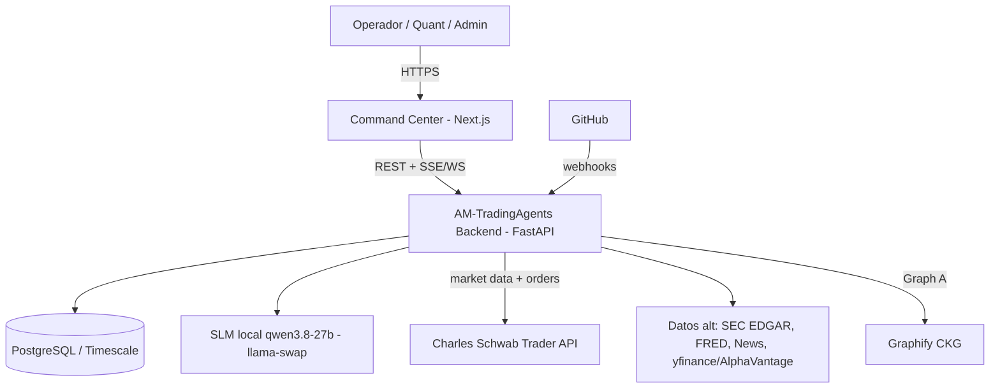
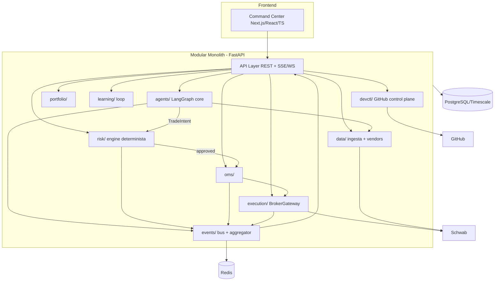
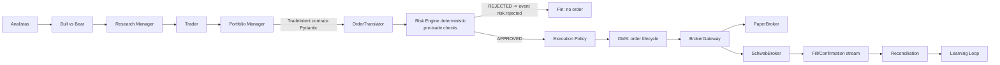

# Target Architecture (C4 + Laws)

## Leyes de arquitectura (fitness functions, verificadas en CI)

1. `agents/` **no importa** `execution/`, `broker/` ni `oms/`. (LLM nunca toca el broker.)
2. El camino de una operación es **único**: `TradeIntent → RiskEngine → ExecutionPolicy → OMS → BrokerGateway → Broker`.
3. `risk/engine` **no importa** ningún cliente LLM. Riesgo = determinista.
4. `BrokerGateway` es una interfaz; los concretos (`PaperBroker`, `BacktestBroker`, `SchwabBroker`) solo se referencian por inyección de dependencias, nunca por import directo desde capas superiores.
5. Ninguna capa de UI/API accede directamente al broker; todo pasa por el backend de dominio.
6. Todo `event` de runtime lleva `correlation_id` + `run_id` (trazabilidad).

## C4 — Nivel 1: System Context



## C4 — Nivel 2: Containers



## C4 — Nivel 3: Component (flujo de decisión → ejecución)



## Mapeo capa ↔ carpeta (repository structure objetivo)

```
tradingagents/
  dataflows/        # MP-01 ingesta + vendors (schwab.py añadido)
  agents/           # MP-02/03 grafo LLM (NO importa execution/broker/oms)
  graph/            # LangGraph wiring
  portfolio/        # estado de cartera + P&L
  risk/             # MP-04 Risk Engine DETERMINISTA (NO importa LLM)
  oms/              # MP-05 order management
  execution/        # MP-05 BrokerGateway + PaperBroker + SchwabBroker
  learning/         # MP-06 loop de aprendizaje
  events/           # event bus + runtime aggregator
  devctl/           # GitHub control plane, métricas de desarrollo
apps/
  api/              # FastAPI (REST + SSE/WS)
  web/              # Next.js Command Center
docs/               # System of Record
migrations/         # Alembic
tests/              # pirámide de tests + fitness functions
```

## Estados de agente (state machine, §41)

```mermaid
stateDiagram-v2
  [*] --> IDLE
  IDLE --> QUEUED --> STARTING --> FETCHING_DATA --> PROCESSING
  PROCESSING --> DEBATING: researchers
  PROCESSING --> REVIEWING: manager
  DEBATING --> REVIEWING
  REVIEWING --> APPROVING
  REVIEWING --> REJECTING
  APPROVING --> EXECUTING
  EXECUTING --> COMPLETED
  PROCESSING --> WAITING --> PROCESSING
  STARTING --> FAILED
  FETCHING_DATA --> FAILED
  PROCESSING --> FAILED
  FAILED --> RETRYING --> PROCESSING
  IDLE --> BLOCKED
  COMPLETED --> [*]
  REJECTING --> [*]
  FAILED --> [*]
  CANCELLED --> [*]
```

## Dos grafos, una plataforma

- **Graph A — Code Knowledge Graph:** fuente Graphify. Responde *¿cómo está construido el software?* Estático, regenerado en CI.
- **Graph B — Runtime Agent Graph:** fuente eventos+telemetría. Responde *¿qué hace el sistema ahora?* Live vía SSE.
- Navegación cruzada: nodo runtime → implementación (Graph A) → fichero → Story → PR.
