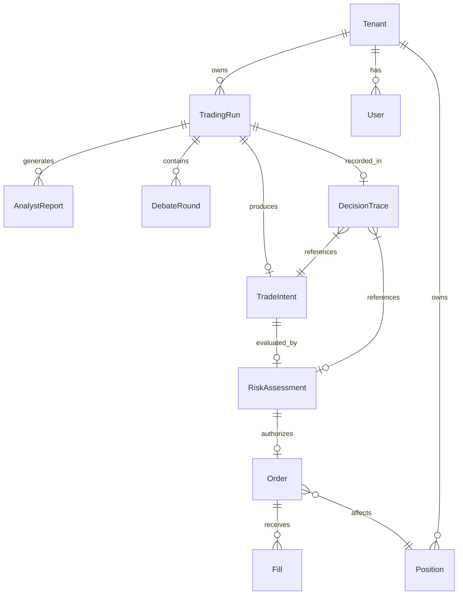

# Domain Model

Modelo de dominio del sistema AM-TradingAgents.
Organizado siguiendo principios de Domain-Driven Design.

---

## Aggregates y Entities principales

### Aggregate: TradingRun
**Root:** `TradingRun`
Representa una ejecución completa del pipeline agéntico para un símbolo.

```
TradingRun
  id: UUID (run_id)
  symbol: Symbol (VO)
  mode: TradingMode (BACKTEST|PAPER|SHADOW|LIVE)
  status: RunStatus
  started_at: datetime
  completed_at: datetime | None
  config_snapshot: dict          # snapshot inmutable de config al inicio
  correlation_id: UUID
  tenant_id: TenantId (VO)
```

Entities dentro del aggregate:
- `AnalystReport` (uno por analista)
- `DebateRound` (0..N rondas Bull/Bear)
- `TradeIntent` (0 o 1 por run)
- `RiskAssessment` (0 o 1 por TradeIntent)

---

### Aggregate: TradeIntent
**Root:** `TradeIntent`
Contrato de salida del cerebro agéntico hacia el Risk Engine.
**Este es el contrato pivotal entre agentes y ejecución.**

```
TradeIntent
  id: UUID (intent_id)
  run_id: UUID → TradingRun
  symbol: Symbol (VO)
  action: IntentAction (BUY|SELL|SELL_SHORT|BUY_TO_COVER|HOLD)
  rationale: str                 # resumen no-confidencial
  confidence: float              # 0.0–1.0
  entry_price_target: Decimal | None
  stop_loss: Decimal | None
  take_profit: Decimal | None
  position_size_pct: float | None  # % del portfolio sugerido por agente
  time_horizon: str              # "intraday" | "swing" | "position"
  created_at: datetime
  portfolio_context_snapshot: dict  # snapshot del portfolio en el momento
  analyst_report_ids: list[UUID]
  debate_round_ids: list[UUID]
```

Invariant: `action != HOLD` implies `stop_loss is not None`.
Invariant: `confidence` in [0.0, 1.0].

---

### Aggregate: RiskAssessment
**Root:** `RiskAssessment`
Decisión determinista del Risk Engine sobre un TradeIntent.

```
RiskAssessment
  id: UUID
  intent_id: UUID → TradeIntent
  run_id: UUID → TradingRun
  verdict: RiskVerdict (APPROVED|REJECTED|MODIFIED)
  rules_evaluated: list[RuleEvaluation]
  approved_quantity: Decimal | None    # puede diferir de lo propuesto
  approved_notional: Decimal | None
  rejection_reasons: list[str]
  pre_trade_checks: PreTradeChecks (VO)
  evaluated_at: datetime
  risk_engine_version: str
```

Value Object `PreTradeChecks`:
```
  position_limit_ok: bool
  exposure_limit_ok: bool
  daily_loss_limit_ok: bool
  max_drawdown_ok: bool
  concentration_ok: bool
  volatility_ok: bool
  kill_switch_active: bool
```

Invariant: si `kill_switch_active == True` → `verdict = REJECTED` siempre.
Invariant: `risk_engine` NO importa ningún módulo LLM.

---

### Aggregate: Order
**Root:** `Order`
Ciclo de vida de una orden en el OMS interno.

```
Order
  id: UUID (order_id)
  client_order_id: str      # idempotency key
  intent_id: UUID → TradeIntent
  assessment_id: UUID → RiskAssessment
  run_id: UUID → TradingRun
  symbol: Symbol (VO)
  side: OrderSide (BUY|SELL|SELL_SHORT|BUY_TO_COVER)
  order_type: OrderType
  quantity: Decimal
  limit_price: Decimal | None
  stop_price: Decimal | None
  time_in_force: TimeInForce
  status: OrderStatus
  broker_order_id: str | None
  submitted_at: datetime | None
  filled_at: datetime | None
  cancelled_at: datetime | None
  mode: TradingMode
  dry_run: bool
```

Entities dentro del aggregate:
- `Fill` (0..N fills parciales)

```
Fill
  id: UUID
  order_id: UUID
  quantity: Decimal
  price: Decimal
  commission: Decimal
  filled_at: datetime
  broker_fill_id: str
```

Invariant: `sum(fill.quantity) <= order.quantity`.
Invariant: `mode == LIVE` requires `dry_run == False AND confirm == True` en BrokerGateway.

---

### Aggregate: Position
**Root:** `Position`
Posición actual del portfolio para un símbolo.

```
Position
  id: UUID
  tenant_id: TenantId (VO)
  account_id: str
  symbol: Symbol (VO)
  quantity: Decimal          # positivo = long, negativo = short
  average_price: Decimal
  current_price: Decimal
  unrealized_pnl: Decimal    # calculado, no persistido (derivado)
  realized_pnl: Decimal
  opened_at: datetime
  updated_at: datetime
```

---

### Aggregate: PortfolioState
**Root:** `PortfolioState`
Snapshot del estado del portfolio en un momento dado.

```
PortfolioState
  id: UUID
  tenant_id: TenantId (VO)
  account_id: str
  cash: Decimal
  currency: str
  equity: Decimal
  buying_power: Decimal
  positions: list[PositionSnapshot]   # VO inmutable
  total_exposure: Decimal
  max_drawdown: float
  daily_pnl: Decimal
  captured_at: datetime
```

---

### Aggregate: DecisionTrace
**Root:** `DecisionTrace`
Registro inmutable y auditable de una decisión completa.
**Nunca contiene chain-of-thought privado.**

```
DecisionTrace
  id: UUID
  run_id: UUID → TradingRun
  symbol: Symbol (VO)
  decision_at: datetime
  market_context: MarketContext (VO)
  analyst_reports: list[AnalystReportSummary]  # no raw CoT
  bull_summary: str
  bear_summary: str
  manager_decision: str
  trade_intent: TradeIntentSummary (VO)
  risk_assessment: RiskAssessmentSummary (VO)
  orders: list[OrderSummary]
  fills: list[FillSummary]
  outcome: TradeOutcome | None    # se completa post-cierre
  model_version: str
  prompt_version: str
  strategy_version: str
  agent_versions: dict[str, str]
```

Value Object `TradeOutcome` (completado al cerrar posición):
```
  exit_price: Decimal
  exit_at: datetime
  pnl: Decimal
  pnl_pct: float
  mae: float    # Maximum Adverse Excursion
  mfe: float    # Maximum Favorable Excursion
  holding_days: int
  exit_reason: str
```

---

### Aggregate: AnalystReport
Resultado estructurado de un analista.

```
AnalystReport
  id: UUID
  run_id: UUID → TradingRun
  analyst_type: AnalystType (TECHNICAL|FUNDAMENTAL|NEWS|SENTIMENT|MACRO)
  symbol: Symbol (VO)
  rating: Rating (BUY|OVERWEIGHT|HOLD|UNDERWEIGHT|SELL)
  confidence: float
  summary: str                   # no CoT privado
  key_signals: list[str]
  data_sources: list[str]
  model_version: str
  generated_at: datetime
  tokens_used: int
  cost_usd: Decimal
```

---

### Aggregate: DebateRound
Una ronda del debate Bull vs Bear.

```
DebateRound
  id: UUID
  run_id: UUID → TradingRun
  round_number: int
  bull_argument: str
  bear_argument: str
  bull_confidence: float
  bear_confidence: float
  manager_synthesis: str | None    # solo al final
  completed_at: datetime
```

---

### Entity: Tenant (SaaS)

```
Tenant
  id: TenantId (VO)
  name: str
  plan: SaasPlan (FREE|PRO|ENTERPRISE)
  created_at: datetime
  settings: TenantSettings
```

---

### Entity: User

```
User
  id: UUID
  tenant_id: TenantId
  email: str
  role: UserRole (ADMIN|TRADER|VIEWER|READONLY)
  created_at: datetime
  last_login: datetime | None
```

---

## Value Objects

| VO | Fields | Invariants |
|---|---|---|
| `Symbol` | ticker: str, exchange: str | ticker non-empty, uppercase |
| `TenantId` | value: UUID | immutable |
| `TradingMode` | BACKTEST / PAPER / SHADOW / LIVE | enum |
| `OrderSide` | BUY / SELL / SELL_SHORT / BUY_TO_COVER | enum |
| `OrderType` | MARKET / LIMIT / STOP / STOP_LIMIT / TRAILING_STOP | enum |
| `TimeInForce` | DAY / GTC / IOC / FOK | enum |
| `Rating` | BUY / OVERWEIGHT / HOLD / UNDERWEIGHT / SELL | enum |
| `RunStatus` | PENDING / RUNNING / COMPLETED / FAILED / CANCELLED | enum |
| `OrderStatus` | PENDING / SUBMITTED / PARTIAL / FILLED / CANCELLED / REJECTED / EXPIRED | enum |
| `RiskVerdict` | APPROVED / REJECTED / MODIFIED | enum |
| `MarketContext` | symbol, price, volume, timestamp, indicators: dict | immutable snapshot |

---

## Domain Events

Todos los eventos incluyen: `event_id`, `event_type`, `timestamp`, `run_id`, `correlation_id`,
`causation_id`, `tenant_id`, `story_id` (cuando aplica).

| Event | Emitido por | Descripción |
|---|---|---|
| `TradingRunStarted` | TradingRun | Inicia pipeline |
| `DataFetchCompleted` | DataEngine | Datos listos para agentes |
| `AnalystReportCreated` | AnalystAgent | Un analista completó su análisis |
| `DebateRoundCompleted` | DebateOrchestrator | Ronda Bull/Bear completada |
| `TradeIntentCreated` | PortfolioManager | Cerebro emitió intención |
| `TradeIntentHeld` | PortfolioManager | Decisión HOLD — no genera orden |
| `RiskAssessmentCompleted` | RiskEngine | Risk Engine evaluó la intención |
| `RiskApproved` | RiskEngine | Aprobado — fluye a OMS |
| `RiskRejected` | RiskEngine | Rechazado — fin del pipeline |
| `OrderCreated` | OMS | Orden creada en OMS interno |
| `OrderSubmitted` | BrokerGateway | Enviada al broker (o dry-run) |
| `OrderFilled` | BrokerGateway | Confirmación de fill |
| `OrderCancelled` | OMS / BrokerGateway | Orden cancelada |
| `PositionOpened` | PortfolioService | Nueva posición abierta |
| `PositionUpdated` | PortfolioService | Posición modificada |
| `PositionClosed` | PortfolioService | Posición cerrada |
| `KillSwitchActivated` | RiskEngine | Kill switch disparado |
| `TradingRunCompleted` | TradingRun | Pipeline completado |
| `TradingRunFailed` | TradingRun | Pipeline falló |
| `DecisionTraceCreated` | AuditService | Traza inmutable registrada |

---

## Domain Commands

| Command | Ejecutado por | Descripción |
|---|---|---|
| `StartTradingRun` | API / Scheduler | Inicia pipeline para símbolo |
| `CancelTradingRun` | API / RiskEngine | Cancela run en curso |
| `EvaluateTradeIntent` | RiskEngine | Evalúa TradeIntent |
| `PlaceOrder` | OMS | Crea y envía orden |
| `CancelOrder` | OMS | Cancela orden |
| `ActivateKillSwitch` | API / RiskEngine | Activa kill switch global |
| `DeactivateKillSwitch` | API (admin only) | Desactiva kill switch |
| `UpdateRiskLimits` | API | Actualiza límites de riesgo |

---

## Domain Policies

| Policy | Regla |
|---|---|
| `LiveModePolicy` | LIVE requiere `TradingMode.LIVE` explícito + `confirm=True` por llamada |
| `KillSwitchPolicy` | Si kill switch activo → TODOS los intents son REJECTED sin evaluación |
| `RiskEngineIsolationPolicy` | `risk/engine` nunca importa LLM client — verificado en CI |
| `AgentBrokerIsolationPolicy` | `agents/` nunca importa `execution/`, `broker/`, `oms/` — CI fitness function |
| `IdempotencyPolicy` | `client_order_id` garantiza que el mismo intent no genere dos órdenes |
| `DryRunDefaultPolicy` | Sin `confirm=True` + modo LIVE → siempre dry_run=True |
| `NoCoTStoragePolicy` | Chain-of-thought privado nunca se persiste en DB |
| `TraceabilityPolicy` | Todo evento de runtime lleva `correlation_id` + `run_id` |

---

## Domain Invariants

1. Un `TradingRun` tiene exactamente 0 o 1 `TradeIntent`.
2. Un `TradeIntent` tiene exactamente 0 o 1 `RiskAssessment`.
3. Un `RiskAssessment` con `verdict=APPROVED` genera exactamente 1 `Order` inicial.
4. `risk/engine` no depende de ningún LLM client (fitness function en CI).
5. `agents/` no importa `execution/`, `oms/`, ni `broker/` directamente.
6. `Order.mode == LIVE` implica `broker_order_id is not None` tras fill exitoso.
7. `DecisionTrace` es inmutable tras su creación.
8. Todo `event` de dominio lleva `correlation_id` del `TradingRun` que lo originó.
9. `KillSwitch` activo bloquea TODOS los nuevos `TradeIntent` sin excepción.
10. `TradingMode.LIVE` nunca es el modo por defecto en ningún componente.

---

## Diagrama de relaciones clave (Mermaid)


