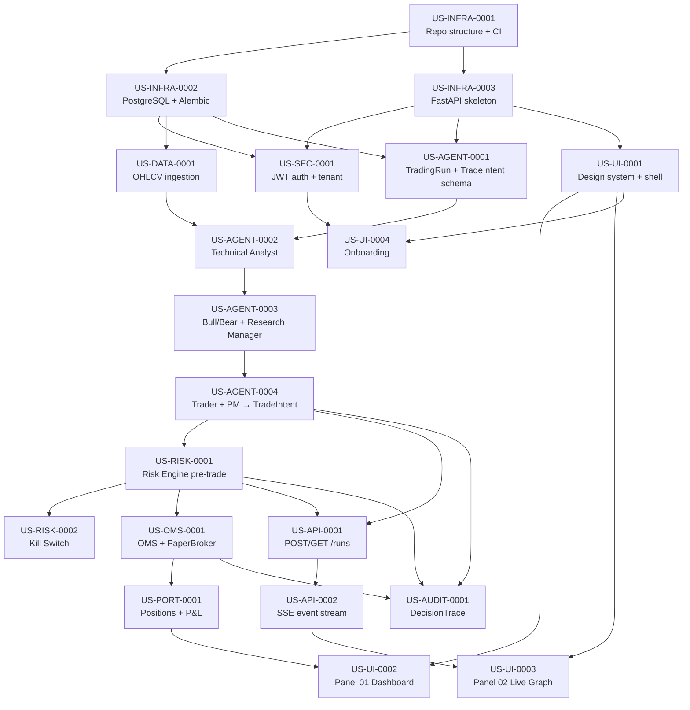

# Story Dependency Graph

Grafo de dependencias entre historias.
La secuencia topológica determina el orden de implementación.

---

## Grafo (Mermaid)



---

## Tabla de dependencias

| Story ID | depends_on | blocks | Estado |
|---|---|---|---|
| US-INFRA-0001 | — | US-INFRA-0002, US-INFRA-0003 | READY |
| US-INFRA-0002 | US-INFRA-0001 | US-SEC-0001, US-DATA-0001, US-AGENT-0001 | BLOCKED |
| US-INFRA-0003 | US-INFRA-0001 | US-SEC-0001, US-AGENT-0001, US-UI-0001 | BLOCKED |
| US-SEC-0001 | US-INFRA-0002, US-INFRA-0003 | US-UI-0004 | BLOCKED |
| US-DATA-0001 | US-INFRA-0002 | US-AGENT-0002 | BLOCKED |
| US-AGENT-0001 | US-INFRA-0002, US-INFRA-0003 | US-AGENT-0002 | BLOCKED |
| US-AGENT-0002 | US-AGENT-0001, US-DATA-0001 | US-AGENT-0003 | BLOCKED |
| US-AGENT-0003 | US-AGENT-0002 | US-AGENT-0004 | BLOCKED |
| US-AGENT-0004 | US-AGENT-0003 | US-RISK-0001, US-API-0001, US-AUDIT-0001 | BLOCKED |
| US-RISK-0001 | US-AGENT-0004 | US-RISK-0002, US-OMS-0001, US-API-0001, US-AUDIT-0001 | BLOCKED |
| US-RISK-0002 | US-RISK-0001 | — | BLOCKED |
| US-OMS-0001 | US-RISK-0001 | US-PORT-0001, US-AUDIT-0001 | BLOCKED |
| US-PORT-0001 | US-OMS-0001 | US-UI-0002 | BLOCKED |
| US-API-0001 | US-AGENT-0004, US-RISK-0001 | US-API-0002 | BLOCKED |
| US-API-0002 | US-API-0001 | US-UI-0003 | BLOCKED |
| US-AUDIT-0001 | US-AGENT-0004, US-RISK-0001, US-OMS-0001 | — | BLOCKED |
| US-UI-0001 | US-INFRA-0003 | US-UI-0002, US-UI-0003, US-UI-0004 | BLOCKED |
| US-UI-0002 | US-UI-0001, US-PORT-0001 | — | BLOCKED |
| US-UI-0003 | US-UI-0001, US-API-0002 | — | BLOCKED |
| US-UI-0004 | US-UI-0001, US-SEC-0001 | — | BLOCKED |

---

## Orden topológico validado (secuencia de implementación)

```
Batch 1 — Foundation (paralelo posible):
  1. US-INFRA-0001

Batch 2 — Infrastructure (paralelo posible tras INFRA-0001):
  2. US-INFRA-0002 (DB)
  3. US-INFRA-0003 (FastAPI)

Batch 3 — Base services (secuencial):
  4. US-SEC-0001 (requiere 2+3)
  5. US-DATA-0001 (requiere 2)
  6. US-AGENT-0001 (requiere 2+3)

Batch 4 — Agentic brain (secuencial):
  7. US-AGENT-0002 (requiere 5+6)
  8. US-AGENT-0003 (requiere 7)
  9. US-AGENT-0004 (requiere 8)

Batch 5 — Risk & pipeline (paralelo posible tras 9):
  10. US-RISK-0001 (requiere 9)
  17. US-UI-0001 (requiere 3 — paralelo con risk)

Batch 6 — OMS & API (tras 10):
  11. US-RISK-0002 (requiere 10)
  12. US-OMS-0001 (requiere 10)
  14. US-API-0001 (requiere 9+10)

Batch 7 — Portfolio & Audit & SSE (tras 12+14):
  13. US-PORT-0001 (requiere 12)
  15. US-API-0002 (requiere 14)
  16. US-AUDIT-0001 (requiere 9+10+12)

Batch 8 — Frontend panels (tras 17+13+15+4):
  18. US-UI-0002 (requiere 17+13)
  19. US-UI-0003 (requiere 17+15)
  20. US-UI-0004 (requiere 17+4)
```

---

## Estados posibles de una Story

```
DRAFT → REFINED → READY → IN_PROGRESS → PR_OPEN →
IN_REVIEW → CI_FAILED | CI_PASSED → MERGED → VERIFIED → DONE
```

**Reglas de transición:**
- DRAFT → REFINED: todos los campos del contrato completos
- REFINED → READY: dependencias en DONE; arquitectura verificada; Definition of Ready cumplida
- READY → IN_PROGRESS: asignada a agente de desarrollo
- IN_PROGRESS → PR_OPEN: código + tests + docs creados; PR abierto
- PR_OPEN → IN_REVIEW: CI pasa (o falla → CI_FAILED)
- CI_FAILED → IN_PROGRESS: developer agent corrige y actualiza PR
- IN_REVIEW → MERGED: reviewer aprueba + CI pasa + architecture check pasa
- MERGED → VERIFIED: tests de aceptación en entorno de integración pasan
- VERIFIED → DONE: Definition of Done cumplida completamente
